# Minesweeper

# Links

* [Minesweeper - Gameplay](http://roger-takeshita.github.io/game-minesweeper)
* [Origintal Project](https://github.com/Roger-Takeshita/Bootcamp-Software-Engineer/tree/master/004%20-%20Week%203/Project%201%20-%20Mineseweeper)

<h1 id="summary">Summary</h1>

* [History](#history)
* [Pseudocode](#pseudocode)
* [Initial Thoughts](#initial)
* [Technologies Used](#tech)
* [How to Play](#how)

<h1 id="history">History</h1>

[Go Back To Summary](#summary)

* Microsoft Minesweeper (formerly just Minesweeper, and also known as Flower Field) is a minesweeper-type computer game created by Curt Johnson, originally for IBM's OS/2, that was ported to Microsoft Windows by Robert Donner, both Microsoft employees at the time. First officially released as part of the Microsoft Entertainment Pack 1 in 1990, it was first included in the standard install of Windows 3.1 in 1992, replacing Reversi from Windows 3.0. Microsoft Minesweeper was included without major changes in all subsequent Windows releases until Windows Vista, at which time an updated version by Oberon Media replaced it.

<h1 id="pseudocode">Pseudocode</h1>

[Go Back To Summary](#summary)

* 1st step - create an empty board

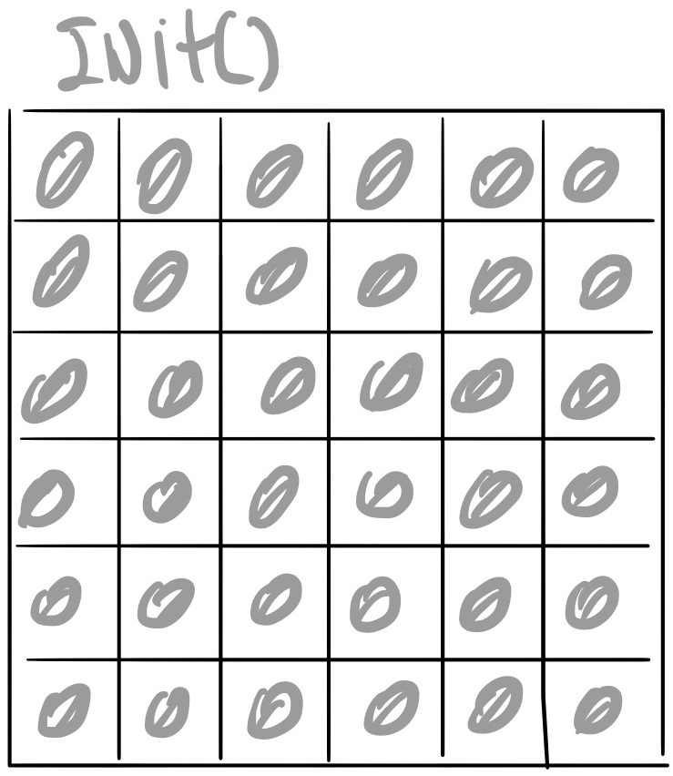

* 2nd step - drop bombs randomly

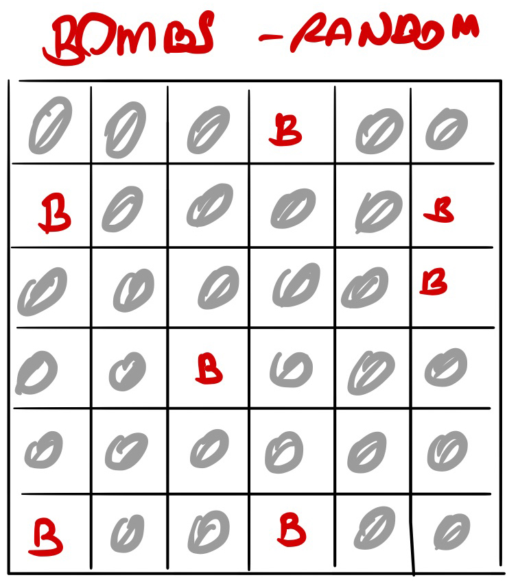

* 3rd step - calculate the number of bombs around each cell

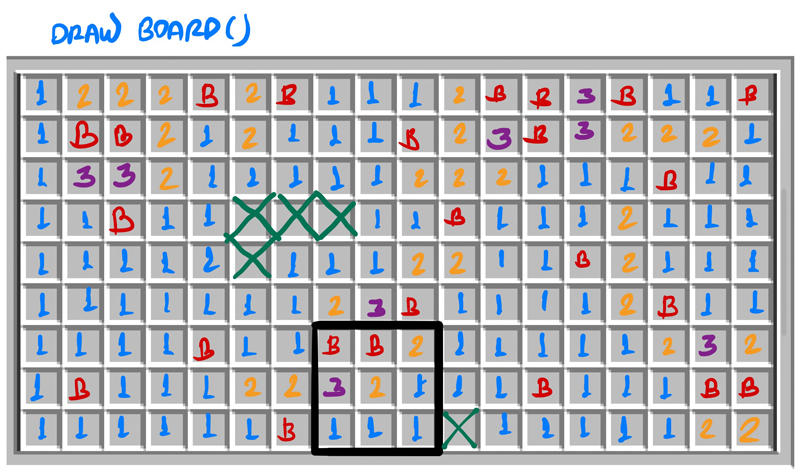

* 4th step - check the all the positions around the cell

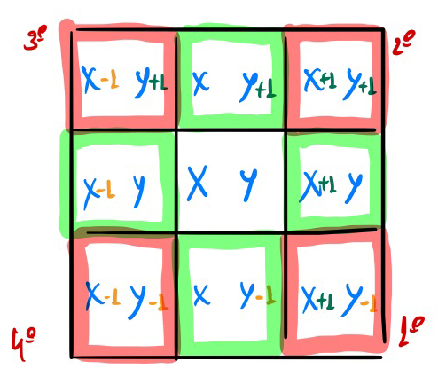

* 5th step - check if it's an empty cell

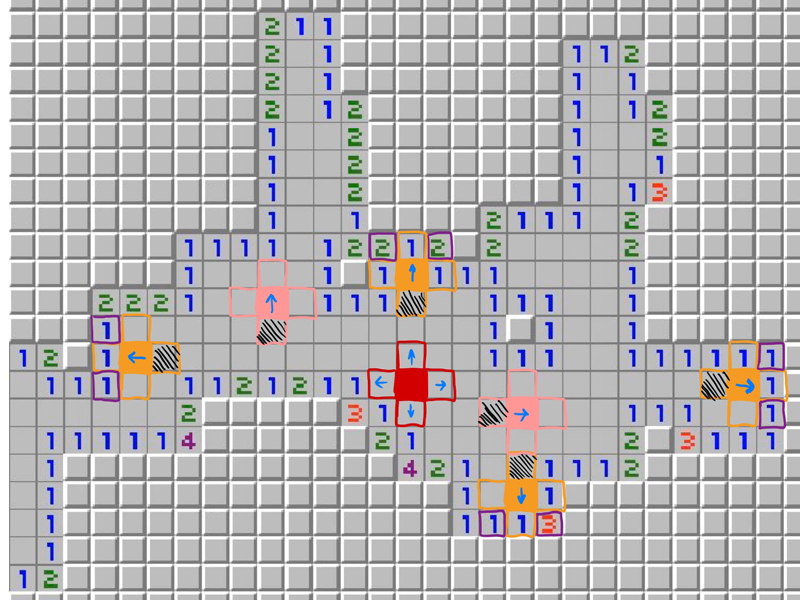

<h1 id="initial">Initial Thoughts</h1>

[Go Back To Summary](#summary)

* drawBoard
   * Create an empty board (2D-array) fill with objects. Each object will store:
   * position x
   * position y
   * number (this will be the number of bombs around this cell)
   * bomb
   * clicked (if this cell had been clicked = `true`, otherwise it's `false`)

* dropBombs
   * Randomly drop bombs on the board, the number of bombs will `**20%**` of the size of the board.

* dropNumbers
   * Calculate the number of bombs around the current cell, the number can be:

      | Number | Meaning                         |
      |--------|---------------------------------|
      | 0      | Empty cell                      |
      | 1 - 8  | Number of bombs around the cell |
      | 10     | Bomb                            |

* 2 Inputs to change the size of the board (1 input for row and 1 input for column)
* A button to apply the settings to the board 
* A button to start the game, this button it'll display the current state of the game (Start, Playing, Lose, Win).
* A timer, to count the time in seconds
* The number of bombs left.

* rightClick
   * Right click of the mouse to add a flag (meaning there is a bomb)

* leftClick
   * Left click of the mouse to reveal a cell

<h1 id="tech">Technologies Used</h1>

[Go Back To Summary](#summary)

* Hypertext Markup Language 5 (HTML)
* Cascading Style Sheets 3 (CSS)
* JavaScript (JS)

<h1 id="how">How to Play</h1>

[Go Back To Summary](#summary)
   
* Input the number of columns and rows, then click on the button `set settings`

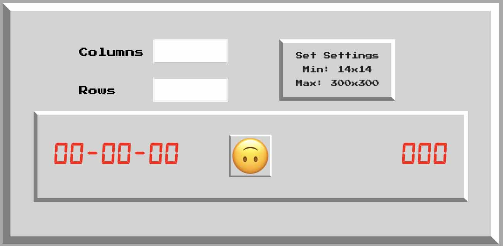

> Respect the minimum/maximum number of columns/rows.

* Once the settings is hidden, click on the smile button

 = Start

 = Playing

 = Lose

 = Win

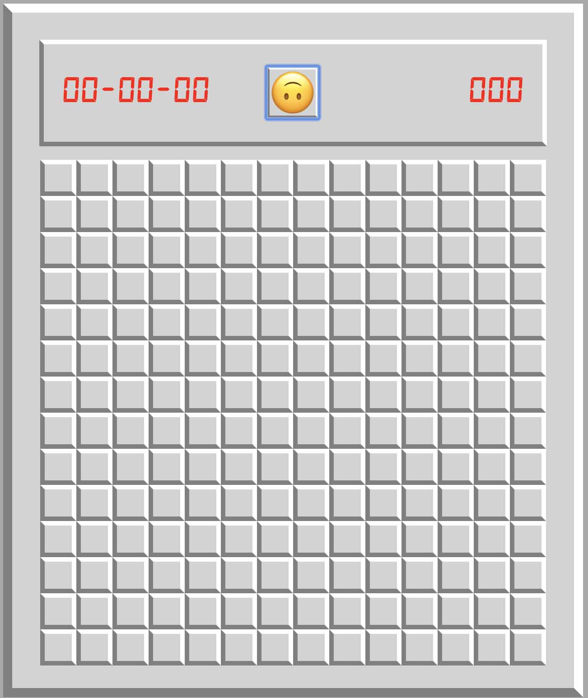

* Each number correspond to the number of bombs around the current cell

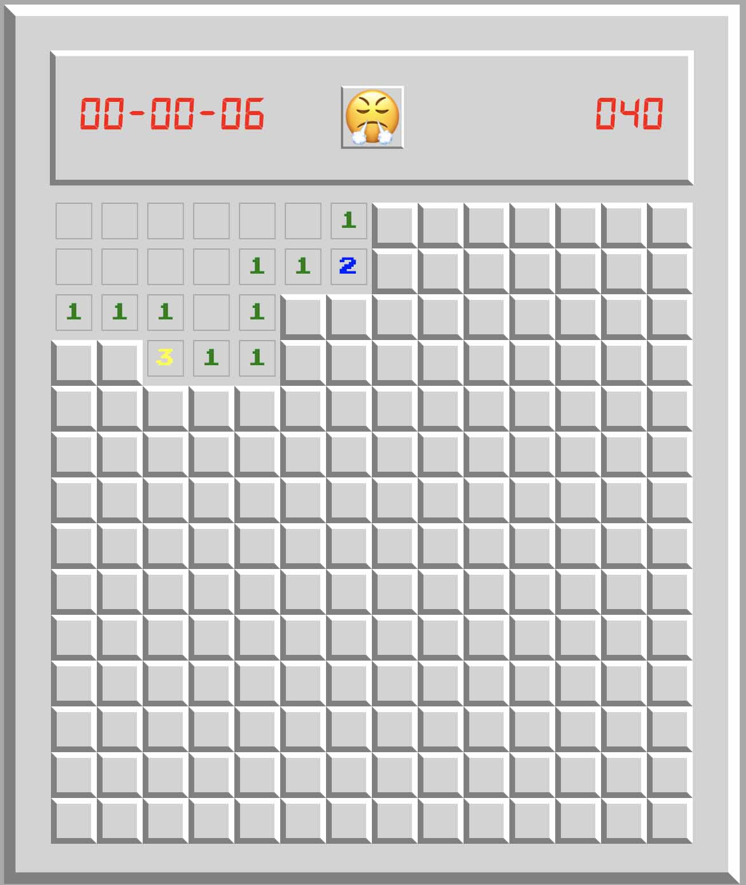

* Right click to add flags (meaning you found a bomb)

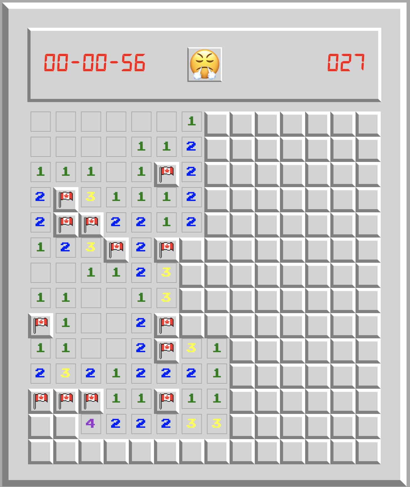

* You Win!

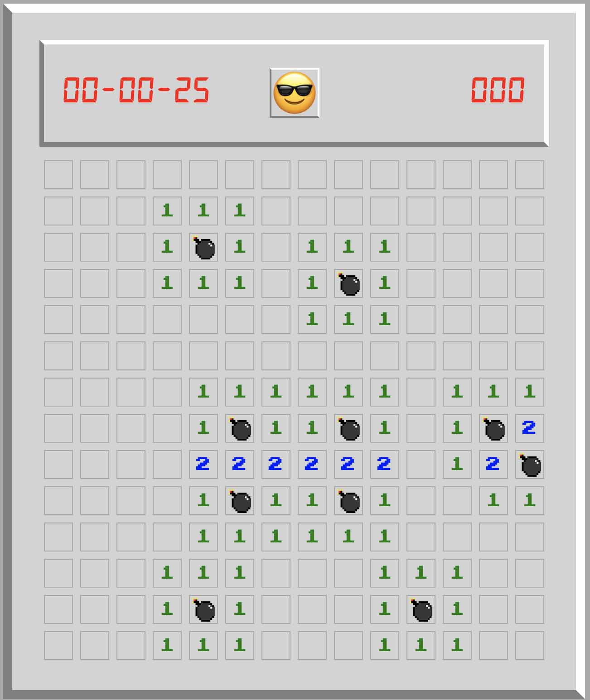

* You lose!

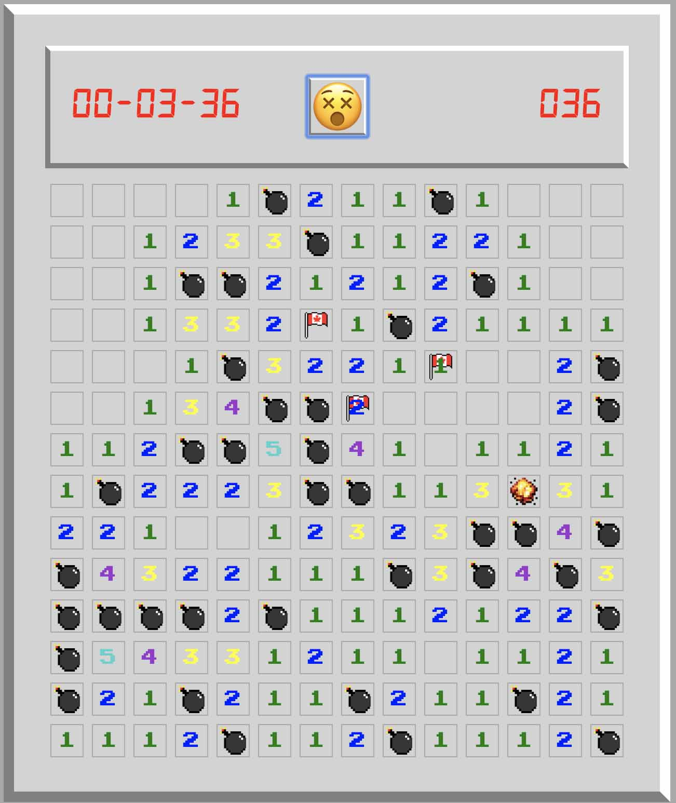
